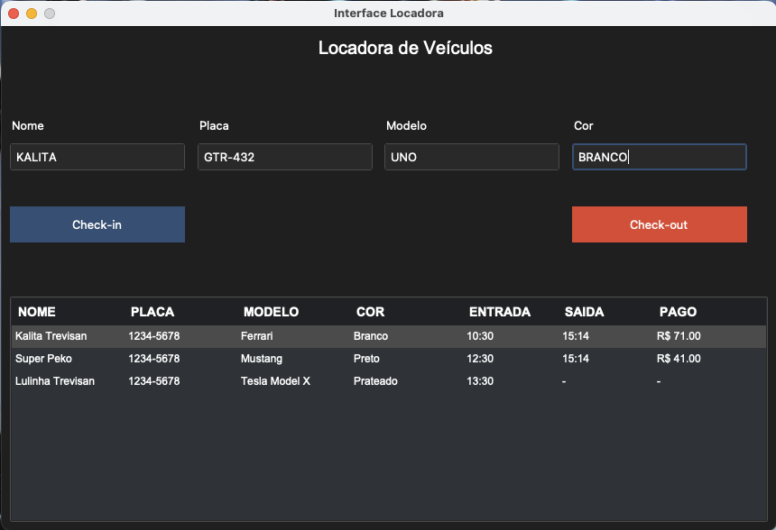
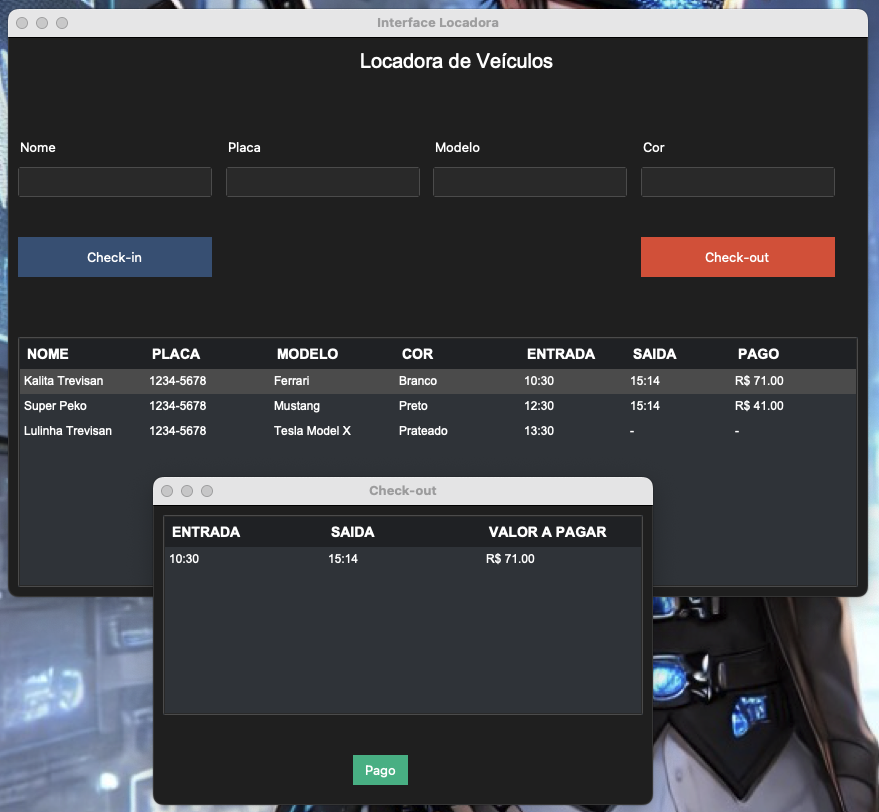

# Gerenciador de Estacionamento

  

 

  

## Descrição

Este é um projeto de uma aplicação para gerenciar o estacionamento de veículos. A aplicação permite o check-in e check-out de veículos, calculando automaticamente o valor a pagar com base no tempo de permanência no estacionamento.

## Funcionalidades

- **Check-in de Veículos:** Adicione informações do veículo, como nome, placa, modelo e cor.
- **Check-out de Veículos:** Calcule o valor a pagar com base no tempo de permanência.
- **Lista de Veículos:** Visualize todos os veículos no estacionamento, incluindo horários de entrada e saída.
- **Interface Gráfica:** Uma interface gráfica amigável construída com `tkinter` e `ttkbootstrap`.

## Tecnologias Utilizadas

- Python 3.x
- tkinter
- ttkbootstrap